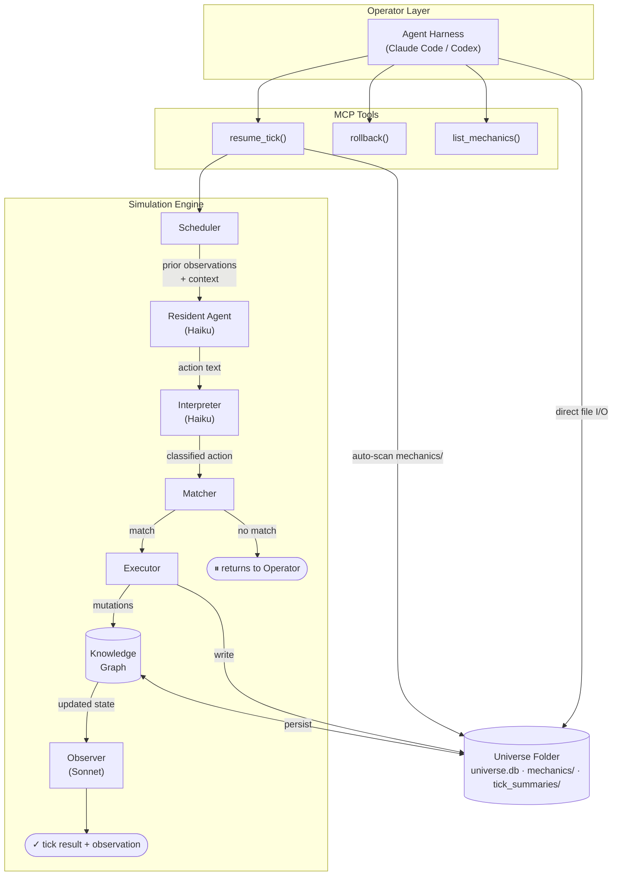
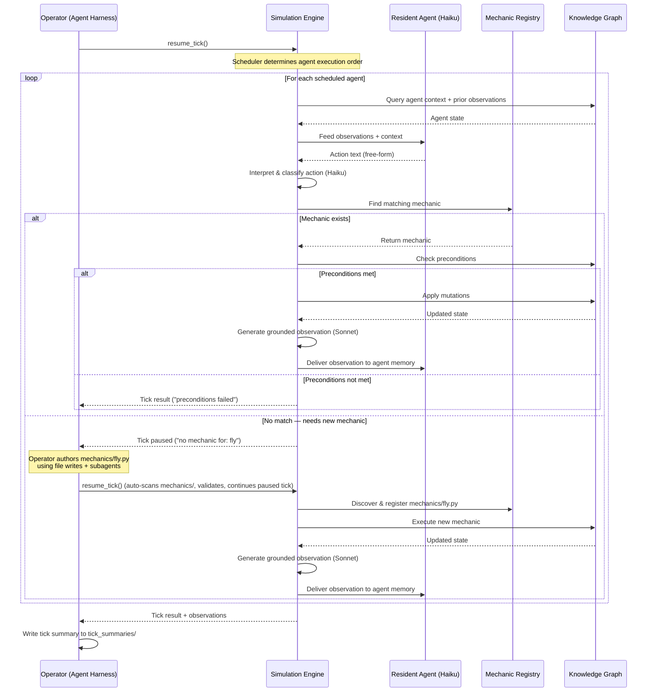
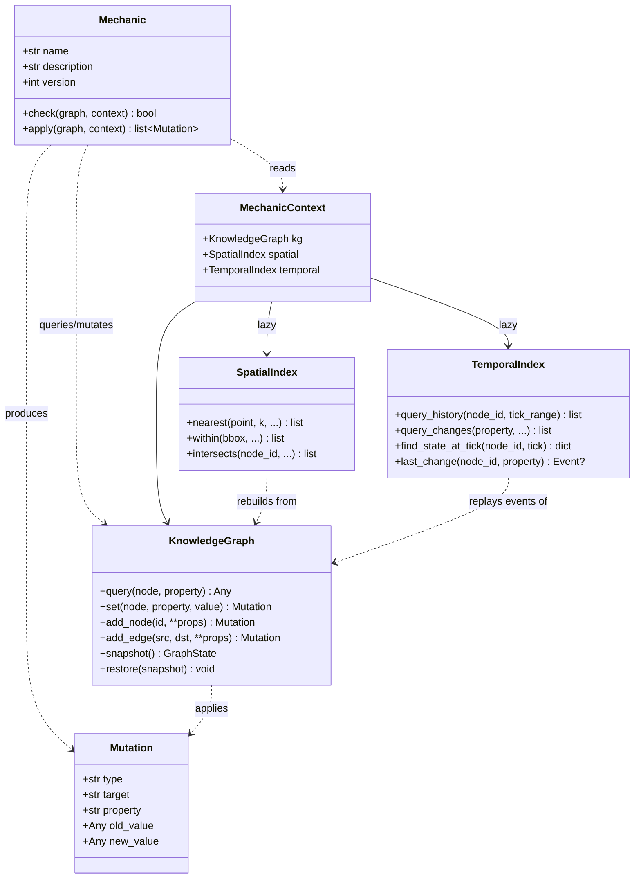
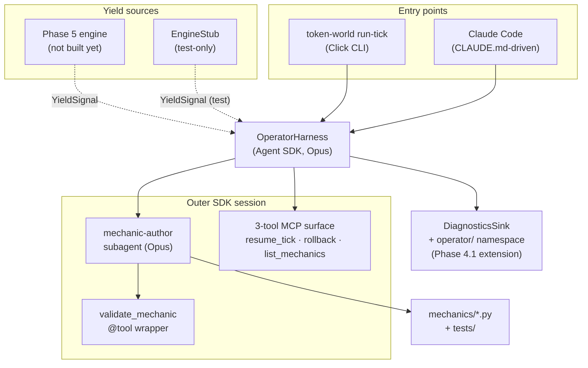

# Architecture Overview

> **See also:** [simulation-pipeline.md](simulation-pipeline.md) for the detailed per-tick flow,
> including the Phase 7 long-running action continuation branch and the Phase 6 playtest/compression
> plumbing. This page stays high-level on purpose.

## System Components

## Core Simulation Loop

## Mechanic Structure

## Spatial & Temporal Primitives

Mechanics reach the graph through `MechanicContext`. Two lazy accessors extend the DSL without adding cost to mechanics that don't use them:

- **`ctx.spatial`** -- R-tree-backed queries (`nearest`, `within`, `intersects`) over nodes with `position=[x, y]` or `bbox=[x1, y1, x2, y2]` properties. Malformed coords are logged and skipped, not raised.
- **`ctx.temporal`** -- Event-log queries (`query_history`, `query_changes`, `find_state_at_tick`, `last_change`) over the mem+disk-merged event stream. Reconstructs node state at any reachable tick via snapshot baseline + event replay.

Both are pay-for-what-you-use: `ctx._spatial` / `ctx._temporal` stay `None` until first access.

## Operator Tooling

- **`token-world create <slug>`** -- scaffold a new universe folder.
- **`token-world list`** -- enumerate known universes.
- **`token-world viz-graph <slug>`** -- render the knowledge graph as a Mermaid `flowchart LR` with category styling, label/ID sanitisation, and filters (`--node`, `--depth`, `--type`, `--has-property`, `--exclude-property`, `--max-nodes`). See the [viz-graph guide](../guides/viz-graph.md).

## Quality

Two canonical discipline docs gate merges and overnight runs:

- **[dashboard-qa-checklist.md](../quality/dashboard-qa-checklist.md)** -- required PR pass for any `src/token_world/dashboard/` change (nine interactive checks + Playwright routine + user-mode cooldown).
- **[sim-quality-rubric.md](../quality/sim-quality-rubric.md)** -- seven-dimension scorecard for "is the run healthy?" CI gate on release-tier overnight runs.

## Phase 4.1: Operator Harness

The operator harness catches simulation yields and drives mechanic authoring via the Claude Agent SDK. Two entry points share the same universe MCP surface and the same mechanic-author subagent definition:

- **Programmatic** — `token-world run-tick` (Click CLI) instantiates `OperatorHarness.handle_yield(signal)` directly; used by automated tests and the Phase-6 playtest runner.
- **Interactive** — a human opens Claude Code inside a universe folder. CLAUDE.md's `Operator Flow: When a Tick Yields` section teaches the outer Claude Code session to invoke the `mechanic-author` subagent (filesystem-defined at `.claude/agents/mechanic-author.md`).

Both paths source their mechanic-author prompt from the same `mechanic_author_prompt(universe, yield_json)` Python function (`src/token_world/operator/subagent.py`), so prompt drift between the two is structurally impossible (T-04.1-22 mitigation).

Key contracts:

- **YieldSignal** (`src/token_world/operator/yield_signal.py`) is the locked interface between engine and operator. Frozen+slots dataclass with 7 fields (`tick_id`, `universe_path`, `schema_version`, `reason`, `action_text`, `classified_action`, `actor_state`, `candidate_mechanic_ids`), deterministic JSON round-trip (`sort_keys=True, indent=2`), schema-versioned rejection on unknown `schema_version` values (T-04.1-01).
- **mechanic-author subagent prompt** (`src/token_world/operator/subagent.py::mechanic_author_prompt`) is the single source of truth for both the programmatic `AgentDefinition` and the per-universe `.claude/agents/mechanic-author.md`. Scaffold writes the filesystem agent during `scaffold_universe()` via `token_world.universe.templates.mechanic_author_agent.render_mechanic_author_md()`.
- **Diagnostics operator namespace** (`src/token_world/operator/diagnostics.py`) extends Phase 4's `DiagnosticsSink` with an `operator/` subfolder per tick. Artefacts: `yield_signal.json`, `authoring_attempts.jsonl`, `validation/attempt_NN.json`, `mechanic_diff.patch`, `resume_outcome.json`. Atomic writes use `tempfile.mkstemp + os.fsync + os.replace` mirroring Phase 4's helper. JSONL appends are tolerant of malformed lines on read. The `OperatorDiagnosticsReader` is the single sanctioned parser (D-16).
- **Subagent tool whitelist** excludes `Agent` (Pitfall 5 / T-04.1-23: subagents must not spawn sub-subagents). Includes `mcp__validation__validate_mechanic` (in-process SDK MCP server wrapping the `validate-mechanic` CLI with `shell=False` — T-04.1-11) and `mcp__token-world__list_mechanics` (from the universe's `.mcp.json`).
- **Safety caps** on the outer session: `max_turns=20` and `max_budget_usd=5.0` (SDK-enforced hard cap per BLOCKER-4 resolution in Plan 03). The integration test asserts `cost_usd < 5.0`.
