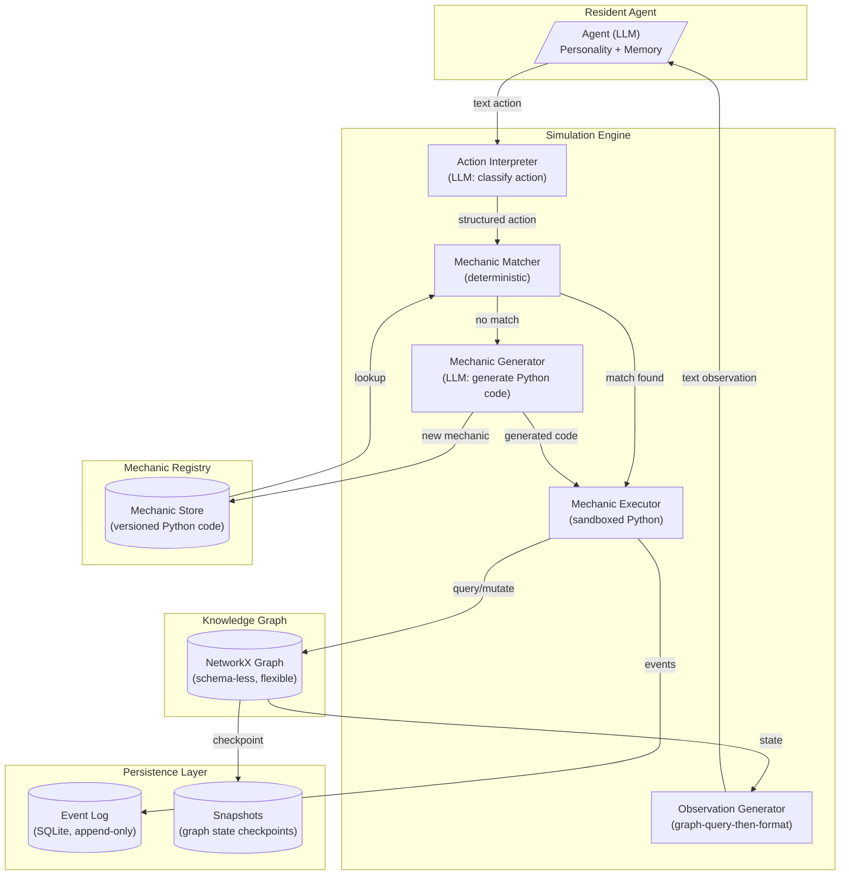
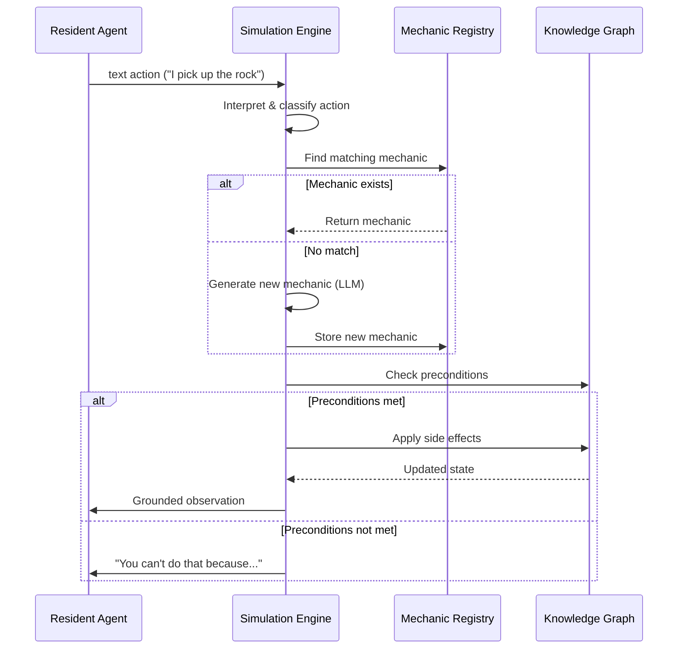
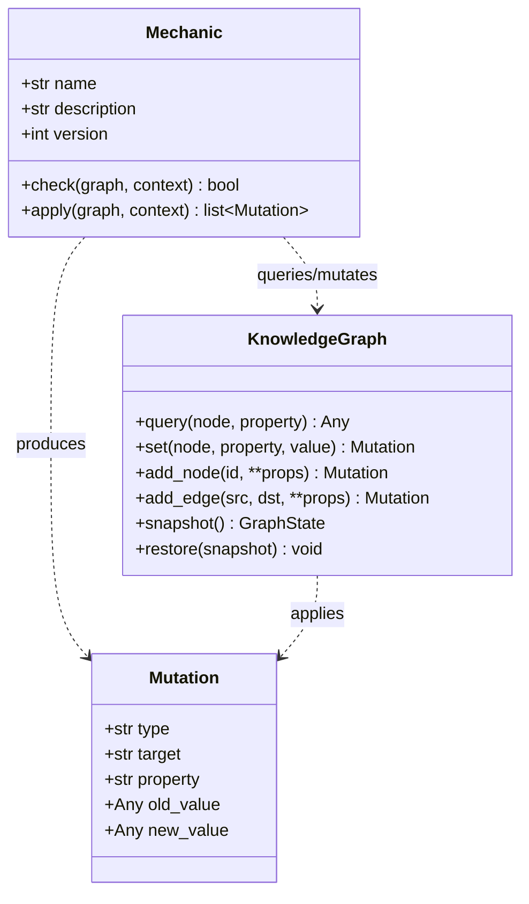

# Architecture Overview

## System Components

```mermaid
graph TD
    subgraph "Resident Agent"
        RA[/"Agent (LLM)\nPersonality + Memory"/]
    end

    subgraph "Simulation Engine"
        AI["Action Interpreter\n(LLM: classify action)"]
        MM["Mechanic Matcher\n(deterministic)"]
        MG["Mechanic Generator\n(LLM: generate Python code)"]
        ME["Mechanic Executor\n(sandboxed Python)"]
        OG["Observation Generator\n(graph-query-then-format)"]
    end

    subgraph "Mechanic Registry"
        MR[("Mechanic Store\n(versioned Python code)")]
    end

    subgraph "Knowledge Graph"
        KG[("NetworkX Graph\n(schema-less, flexible)")]
    end

    subgraph "Persistence Layer"
        EL[("Event Log\n(SQLite, append-only)")]
        SS[("Snapshots\n(graph state checkpoints)")]
    end

    RA -->|"text action"| AI
    AI -->|"structured action"| MM
    MM -->|"match found"| ME
    MM -->|"no match"| MG
    MG -->|"new mechanic"| MR
    MG -->|"generated code"| ME
    ME -->|"query/mutate"| KG
    ME -->|"events"| EL
    KG -->|"state"| OG
    OG -->|"text observation"| RA
    MR -->|"lookup"| MM
    KG -->|"checkpoint"| SS
```

## Core Simulation Loop

```mermaid
sequenceDiagram
    participant A as Resident Agent
    participant E as Simulation Engine
    participant M as Mechanic Registry
    participant G as Knowledge Graph

    A->>E: text action ("I pick up the rock")
    E->>E: Interpret & classify action
    E->>M: Find matching mechanic
    alt Mechanic exists
        M-->>E: Return mechanic
    else No match
        E->>E: Generate new mechanic (LLM)
        E->>M: Store new mechanic
    end
    E->>G: Check preconditions
    alt Preconditions met
        E->>G: Apply side effects
        G-->>E: Updated state
        E->>A: Grounded observation
    else Preconditions not met
        E->>A: "You can't do that because..."
    end
```

## Mechanic Structure

```mermaid
classDiagram
    class Mechanic {
        +str name
        +str description
        +int version
        +check(graph, context) bool
        +apply(graph, context) list~Mutation~
    }

    class KnowledgeGraph {
        +query(node, property) Any
        +set(node, property, value) Mutation
        +add_node(id, **props) Mutation
        +add_edge(src, dst, **props) Mutation
        +snapshot() GraphState
        +restore(snapshot) void
    }

    class Mutation {
        +str type
        +str target
        +str property
        +Any old_value
        +Any new_value
    }

    Mechanic ..> KnowledgeGraph : queries/mutates
    Mechanic ..> Mutation : produces
    KnowledgeGraph ..> Mutation : applies
```
