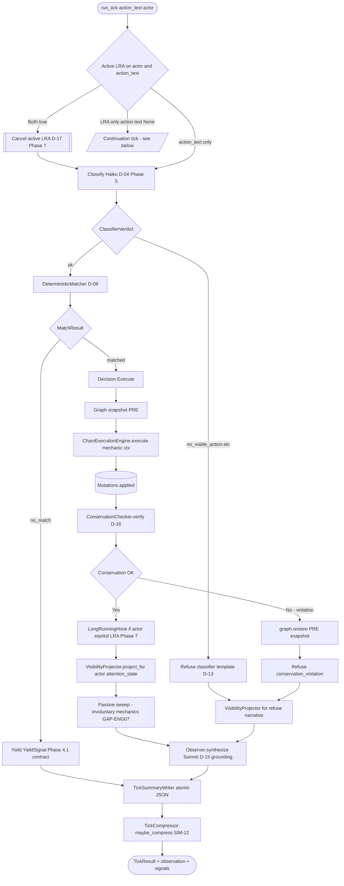
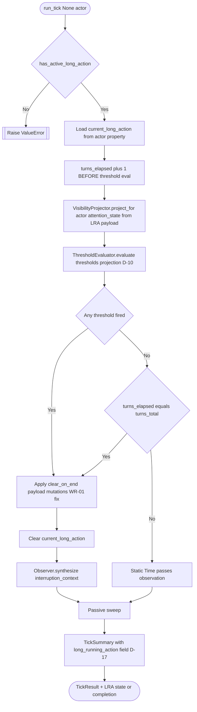

# Simulation Pipeline (Per-Tick Flow)

Detailed breakdown of what happens when `SimulationEngine.run_tick(action_text, actor)` is invoked.
This complements the high-level view in [architecture.md](architecture.md) — look here when you need
to understand *exactly where* a particular concern is handled.

Pipeline is staged and explicit per Phase 5 D-01: each stage is separately testable, separately
observable in diagnostics, and composable into the orchestrator.

## Normal Tick (action_text is a real string)

## Long-Running Continuation Tick (action_text is None)

Phase 7 adds this branch. Used by PlaytestRunner and ResidentAgent when the actor has an active
`LongRunningAction` and no new user input.

## Component Ownership (Which Phase Owns What)

```mermaid
graph LR
    subgraph P5["Phase 5 - Simulation Engine"]
        classifier[classifier.py]
        matcher[matcher.py]
        decider[decider.py]
        refusal[refusal.py]
        visibility[visibility.py - Stages 1-4]
        observer[observer.py]
        conservation[conservation.py]
        summary_writer[summary_writer.py]
        engine5[engine.py - core pipeline]
        mcp[mcp_server.py]
    end

    subgraph P6["Phase 6 - Resident Agent and E2E Loop"]
        resident[resident/]
        playtest[playtest/]
        compressor[compressor.py]
        uc_regression[tests/test_regression/]
    end

    subgraph P7["Phase 7 - Attention and Consciousness"]
        long_running[long_running.py]
        hook[long_running_hook.py]
        visibility_att[visibility.py - Stage 5 attention]
        engine7[engine.py - run_tick None and LRA routing]
        seeds[mechanic/seeds/ sleep autopilot drunk sober_up]
    end

    P5 --> P6
    P5 --> P7
    P6 -.-> P7
```

## Data Flow: Where Each Field in TickSummary Comes From

`TickSummary` (written to `tick_summaries/ticks/tick_<id>.json` per tick) aggregates signals from
every stage. This table shows which stage produces which field.

| Field | Written By | Stage |
|-------|------------|-------|
| `tick_id` | engine | entry |
| `actor_id` | engine | entry |
| `action_text` | engine | entry |
| `kind` (execute\|yield\|refuse) | decider → engine | decide |
| `classification` | classifier → diagnostics adapter | classify |
| `match_result` | matcher | match |
| `decision` | decider | decide |
| `trace` (execution tree) | ChainExecutionEngine | execute |
| `mutations` (flattened) | summary_writer factory | post-execute |
| `conservation_verdict` | ConservationChecker | conservation |
| `projected_state` | VisibilityProjector (via TickResult.projected_state) | project |
| `observation` | Observer | observe |
| `long_running_action` | LongRunningHook (Phase 7) | LRA hook |
| `cost_usd` | summary_writer rate multiplication | post-observe |
| `duration_ms` | engine | exit |

## Cross-Cutting: Diagnostics Fan-Out (AUTO-02)

Each LLM call also writes raw prompt + response + parsed output to Phase 4's diagnostics substrate
under `universe/diagnostics/ticks/tick_<id>/`:

- `classification/prompt.txt`, `classification/response.json`, `classification/parsed.json`
- `observation/prompt.txt`, `observation/response.json`
- `judge/prompt.txt`, `judge/response.json` (Phase 6 optional)
- `compression/batch_<id>/{prompt,response}.txt` (Phase 6 TickCompressor)

## Cost Anatomy (Typical Tick)

- 1× Haiku classify (~$0.0002)
- 1× Sonnet observe (~$0.002)
- 1× Sonnet resident-agent action (Phase 6 E2E, ~$0.002)
- Optional: 1× Sonnet judge on playtest close (~$0.003)
- Optional: 1× Haiku batch compression when `tick_summaries/ticks/` exceeds threshold (~$0.0002 per batch)

Per-tick cost in typical playtest: ~$0.005. 100-turn playtest: ~$0.50. Numbers are rough and
should be reconfirmed against actual Anthropic pricing in `summary_writer.py` rate constants.

## Key Invariants

- **Pipeline is linear.** No stage calls an earlier stage. No cross-stage mutation of each other's state.
- **Graph is the only persistent channel.** Stages communicate via graph properties (actor's `current_long_action`, etc.) or via explicit return values. No module globals carry tick state.
- **Snapshots bracket execute + conservation.** A tick that violates conservation returns the graph to
  its pre-execute state and refuses.
- **LRA continuation never runs the classifier.** It's a cheap synthetic tick.
- **Passive sweep runs after voluntary action.** Voluntary mutations establish new state; passives
  (decay, weather, autopilot_advance, sober_up) react to the new state.

## See Also

- [architecture.md](architecture.md) — higher-level overview
- `.planning/phases/05-simulation-engine/05-CONTEXT.md` — 23 decisions behind Phase 5 pipeline
- `.planning/phases/07-attention-and-consciousness/07-CONTEXT.md` — 23 decisions behind the LRA pattern
